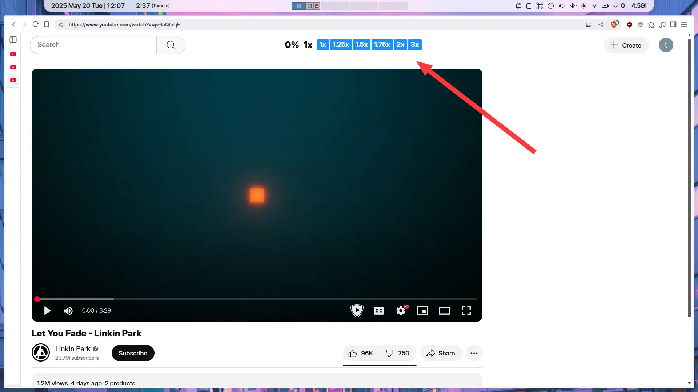

# youtube-percentage-controls-tampermonkey-userscript

Tampermonkey userscript that shows video current watch percentage or whatever, plus some buttons to change playback speed, so that i don't have to hover over the video to reveal the bottom bar, click the settings icon, click the playback speed option, change it, click outside for it to hide, do the same thing again, uhh

### "installation"

1. Install Tampermonkey extension.
2. Create a userscript.
3. Paste whatever is in the main.js file.
4. Hope it works. (it works on my machine)